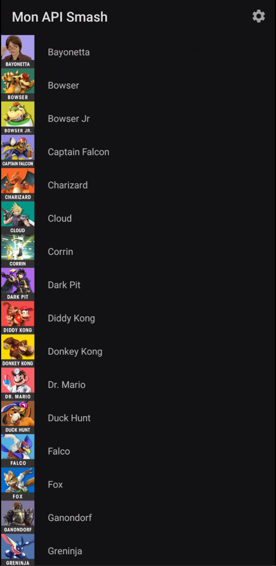
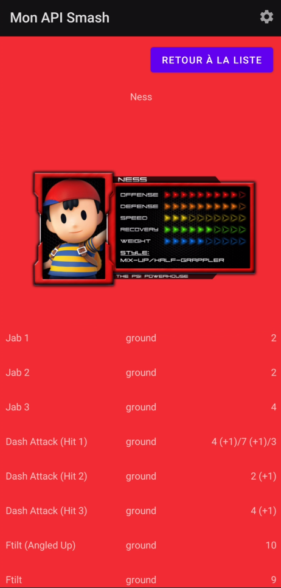
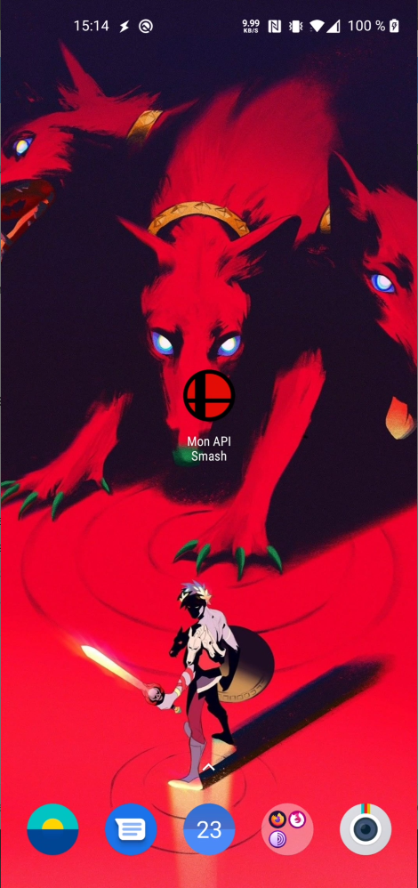
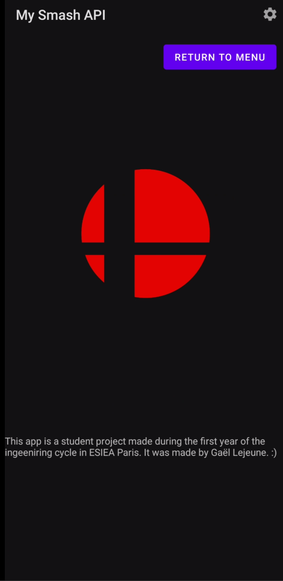
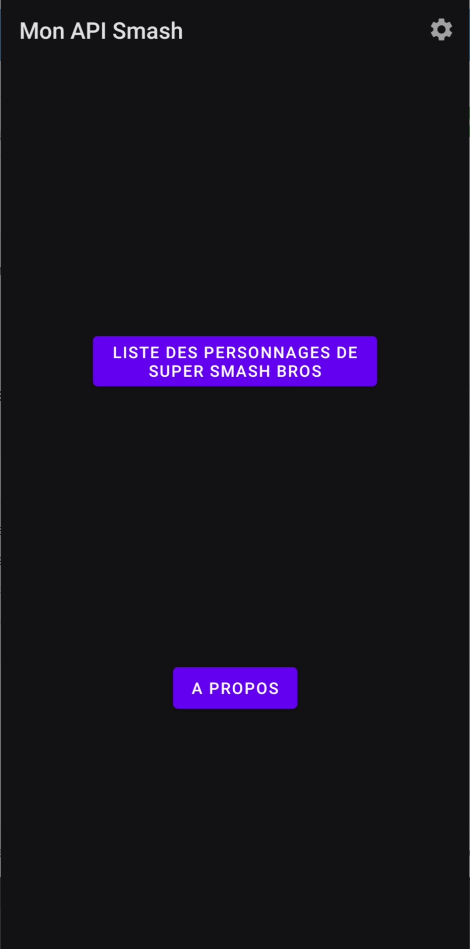

# Projet Mobile ESIEA 2021

## Fonctionnalités demandées
Ce projet est un projet fait dans le cadre du module de programmation Android de la première année du cycle ingénieur de l'ESIEA.

Le projet est sensé présenter les caractéristiques suivantes :
- Ecran avec une liste d'éléments.
- Ecran avec le détail d'un élément
- Appel WebService à une API Rest
- Stockage de données en cache

### Ecran avec liste
L'application contient une liste de personnages jouables récupérées grâce à un appel API Rest à l'API https://api.kuroganehammer.com/swagger/index.html.
Celle-ci est scrollable.

### Ecran avec détails
Lors du clic sur l'un des éléments (personnage), la page de détail est affichée.

#### Informations
Toutes les informations du personnage, ainsi que la couleur de fond du fragment sont affichés dynamiquement en fonction du personnage sélectionné.

#### Mouvements
Les mouvements sont affichés grâce à un second appel à l'API.

### API
#### Informations
*"Restful api for Smash4 and Ultimate frame data as told by @KuroganeHammer."*
C'est une API regroupant les infos de plusieurs personnages de la licence de jeu vidéo "Super Smash Bros".
Elle contient de nombreuses informations tels que les mouvements, images, nom...

#### Appels
Le premier appel permet d'afficher la liste des personnages jouables.
https://api.kuroganehammer.com/api/characters

Le second permet de récuperer les informations de mouvement d'un personnage spécifié lors de son affichage en détail.
https://api.kuroganehammer.com/api/characters/name/DonkeyKong/moves?game=smash4

### Cache
Deux méthodes sont utilisés afin de stocker des informations en cache.
- La première, basée sur le cache de l'API, est implémentée. Cependant, l'API est configurée avec une durée de mise en cache nulle, cela n'est donc pas observable à l'utilisation.
- La seconde utilise les SharedPreferences de Android afin de stocker les informations de Theme choisit par l'utilisateur (clair ou sombre)

## Autres fonctionnalités
Cette section détail les fonctionnalités et usage ajoutés par rapport au projet de base.
### Logo et nom de l'application personnalisés
Le logo et le nom ed l'application ont été modifiés.

### Traduction
Chaque message ou chaine de caratères affichée est dynamiquement traduite en français si c'est la langue principale du téléphone. Pour toutes les autres langues, le texte est en anglais.

### Patterne MVVM
Le patterne MVVM est utilisé pour les fragment de liste et de détail de personnage
### Deuxième appel à l'API
Un deuxième appel à l'API plus spécifique est fait avec un passage d'argument afin de récupérer la liste de mouvements d'un personnage.

### Options en haut à droite
Une icon d'option clickable est disponible en haut à droite, dans toute l'application.
### Theme
Il est possible de changer le thème de l'application (sombre ou clair) via le menu d'option.
### SharedPreferences
La thème sélectionné est enregistré dans le cache grâce à l'utilisation de SharedPreferences dans l'application.

